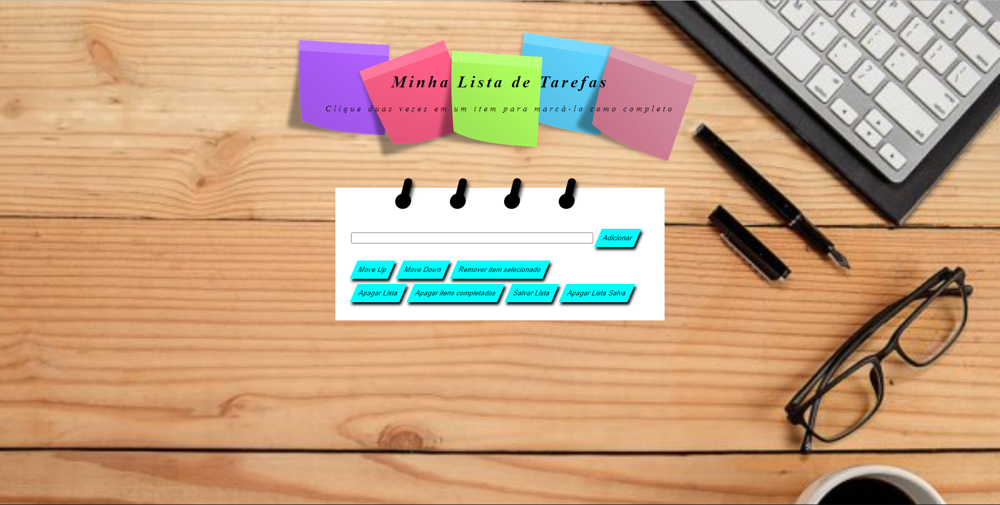

## Projeto Lista de Tarefas

### Sobre o projeto:

O projeto é uma lista de tarefas simples, onde pode adicionar, remover, marca, riscar, excluir e mover itens, além de poder salvar os itens em seu navegador para sempre que precisar pode acessar e conferir a sua lista.

### Demonstração

### Tecnologias usadas:

Front-end:

>Desenvolvido usando: HTML5, CSS3, JavaScript com ES6

### Instalando

Coloque a pasta todo-list no local desejado.

### Executando aplicação

Para rodar, abra o `index.html` em seu navegador, e aproveite o/